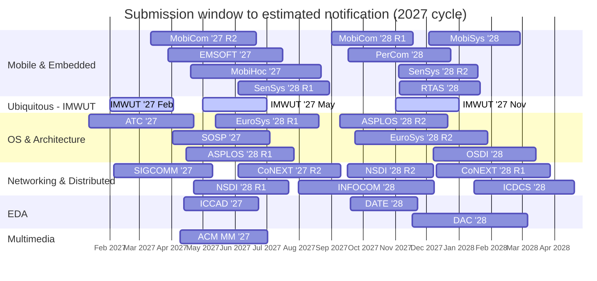

# 📱 Mobile Systems Conference Deadlines (2027)
Submission and peer-review timelines for major conferences in mobile and related systems.

> ⚠️ **Read this first.** As of the validation date below, official CFPs for the 2027 cycle are almost all unreleased. Every **🔶 Projected** date is an estimate anchored to that venue's most recent confirmed edition — a planning hint, **not** an official deadline. **✅ Confirmed** rows are IMWUT/UbiComp's standing rolling-journal schedule. **Est. Notification** is derived from each venue's typical review length and is an estimate in all cases. **Location** shows the announced host in **bold**, else `TBD` with the most recent host. **Acceptance rate** is the most recent *held* edition's full-paper rate (with year). Always confirm against the official CFP before you plan a submission.

- ✅ **Confirmed** = officially announced or a standing recurring schedule &nbsp;·&nbsp; 🔶 **Projected** = estimated from the most recent edition
- Rounds `R1`/`R2` = a venue's separate submission cycles
- **Validated:** 2026-09-28 &nbsp;·&nbsp; **Sources:** [ccfddl/ccf-deadlines](https://github.com/ccfddl/ccf-deadlines) + official CFPs (dates), official sites + [CS Conf Stats](https://csconfstats.xoveexu.com/) / [csconferences](https://github.com/emeryberger/csconferences) (locations, acceptance rates)
- Coverage: 30 submission windows across 6 tracks (3 confirmed, 27 projected)

_Bars span each submission deadline to its estimated notification. **Lighter bars** = ✅ confirmed recurring schedule (IMWUT); **solid bars** = 🔶 projected estimate. Times are approximate — see the table for exact dates and status._

### 📋 CFP Reference Table

_Sorted by submission date. Same data drives the chart above._

| Conference | Submission | Est. Notification | Location | Accept. rate | Status | CFP |
|------------|------------|-------------------|----------|:------------:|:------:|:---:|
| ATC '27 [1] | 2027-01-12 | 2027-04-22 | TBD · last Hong Kong | 16% '25 | 🔶 | [link](https://sigops.org/s/conferences/atc/2026/cfp.html) |
| IMWUT '27 Feb [2] | 2027-02-01 | 2027-04-03 | Seoul, KR (tbc) | ~20-25% | ✅ | [link](https://www.ubicomp.org/) |
| SIGCOMM '27 | 2027-02-05 | 2027-05-10 | **Bangkok, TH** | 16% '25 | 🔶 | [link](https://conferences.sigcomm.org/sigcomm/2027/) |
| MobiCom '27 R2 | 2027-03-12 | 2027-06-21 | TBD · last Hong Kong | 13% '25 | 🔶 | [link](https://www.sigmobile.org/mobicom/) |
| EMSOFT '27 | 2027-03-29 | 2027-07-16 | TBD · last Barcelona, ES | 22% '24 | 🔶 | [link](https://esweek.org/emsoft/) |
| SOSP '27 | 2027-04-02 | 2027-07-04 | TBD · last Prague, CZ | 18% '25 | 🔶 | [link](https://sosp.org/) |
| ACM MM '27 [3] | 2027-04-09 | 2027-07-02 | **Hong Kong** | 24% '25 | 🔶 | [link](https://www.acmmm.org/) |
| ICCAD '27 | 2027-04-13 | 2027-06-23 | TBD · last San Jose, US | 25% '25 | 🔶 | [link](https://iccad.com/) |
| ASPLOS '28 R1 | 2027-04-15 | 2027-07-27 | TBD · last Heraklion, GR | 15% '26 | 🔶 | [link](https://www.asplos-conference.org/) |
| MobiHoc '27 | 2027-04-19 | 2027-08-22 | TBD · last Tokyo, JP | 24% '24 | 🔶 | [link](https://www.sigmobile.org/mobihoc/) |
| NSDI '28 R1 | 2027-04-22 | 2027-07-22 | TBD · last Providence, US | 15% '25 | 🔶 | [link](https://www.usenix.org/conference/nsdi27/call-for-papers) |
| IMWUT '27 May | 2027-05-01 | 2027-07-01 | Seoul, KR (tbc) | ~20-25% | ✅ | [link](https://www.ubicomp.org/) |
| EuroSys '28 R1 | 2027-05-13 | 2027-08-20 | TBD · last Rabat, MA | 12% '25 | 🔶 | [link](https://www.eurosys.org/) |
| SenSys '28 R1 | 2027-06-04 | 2027-08-30 | TBD · last Boulder, US | 19% '26 | 🔶 | [link](https://sensys.acm.org/) |
| CoNEXT '27 R2 | 2027-06-04 | 2027-09-10 | Rio de Janeiro, BR (tbc) | 19% '23 | 🔶 | [link](https://conferences.sigcomm.org/co-next/2026/) |
| INFOCOM '28 [4] | 2027-07-31 | 2027-12-08 | TBD · last Honolulu, US | 19% '25 | 🔶 | [link](https://ccfddl.com/) |
| MobiCom '28 R1 | 2027-09-01 | 2027-11-18 | TBD · last Hong Kong | 13% '25 | 🔶 | [link](https://www.sigmobile.org/mobicom/) |
| ASPLOS '28 R2 | 2027-09-09 | 2027-12-21 | TBD · last Heraklion, GR | 15% '26 | 🔶 | [link](https://www.asplos-conference.org/) |
| NSDI '28 R2 | 2027-09-16 | 2027-12-07 | TBD · last Providence, US | 15% '25 | 🔶 | [link](https://www.usenix.org/conference/nsdi27/call-for-papers) |
| PerCom '28 | 2027-09-17 | 2027-12-24 | TBD · last Goa, IN | 9.5% '24 | 🔶 | [link](https://percom.org/) |
| DATE '28 | 2027-09-19 | 2027-11-22 | TBD · last Dresden, DE | 25% '25 | 🔶 | [link](https://www.date-conference.com/) |
| EuroSys '28 R2 | 2027-09-23 | 2028-01-28 | TBD · last Rabat, MA | 12% '25 | 🔶 | [link](https://www.eurosys.org/) |
| IMWUT '27 Nov | 2027-11-01 | 2028-01-01 | Seoul, KR (tbc) | ~20-25% | ✅ | [link](https://www.ubicomp.org/) |
| SenSys '28 R2 | 2027-11-04 | 2028-01-19 | TBD · last Boulder, US | 19% '26 | 🔶 | [link](https://sensys.acm.org/) |
| RTAS '28 | 2027-11-05 | 2028-01-21 | TBD · last St-Malo, FR | 25% '26 | 🔶 | [link](https://2027.rtas.org/) |
| DAC '28 | 2027-11-17 | 2028-03-06 | **San Jose, US** | 23% '25 | 🔶 | [link](https://www.dac.com/) |
| MobiSys '28 | 2027-12-03 | 2028-02-28 | TBD · last Cambridge, UK | 18% '25 | 🔶 | [link](https://www.sigmobile.org/mobisys/) |
| OSDI '28 | 2027-12-07 | 2028-03-14 | TBD · last Baltimore, US | 16% '25 | 🔶 | [link](https://www.usenix.org/conference/osdi27/call-for-papers) |
| CoNEXT '28 R1 | 2027-12-10 | 2028-03-28 | TBD | 19% '23 | 🔶 | [link](https://conferences.sigcomm.org/co-next/2026/) |
| ICDCS '28 [5] | 2028-01-15 | 2028-04-20 | TBD · last Melbourne, AU | 20% '25 | 🔶 | [link](https://ccfddl.com/) |

**Notes**

1. **ATC** — USENIX ATC ended in 2025; now the **ACM SIGOPS Annual Technical Conference**, resuming its historical January deadline / July conference. Low-confidence date — venue in transition.
2. **IMWUT** — IMWUT is a rolling journal: new-submission deadlines recur every year on Feb 1, May 1 and Nov 1 (Aug 1 is major-revision resubmissions only). UbiComp/ISWC 2027 host (Seoul) is from secondary sources — confirm on ubicomp.org.
3. **ACM MM** — Higher date variance — ACM MM has ranged late-March to late-April recently. Host (Hong Kong) is officially announced.
4. **INFOCOM** — Highest-confidence date — INFOCOM's abstract/paper deadline has been Jul 24 / Jul 31 every year 2022-2027.
5. **ICDCS** — Lowest-confidence date — ICDCS drifts between early December and late January year to year.

### How this was validated
On 2026-09-28 each **submission date** was checked against the community-maintained
[ccfddl/ccf-deadlines](https://github.com/ccfddl/ccf-deadlines) dataset and, where a
page existed, the official CFP. **Locations** come from official conference sites when
the host is announced (bold), otherwise `TBD` with the most recent known host.
**Acceptance rates** are the most recent held edition's full-paper rate from official
sites and the [CS Conf Stats](https://csconfstats.xoveexu.com/) / [csconferences](https://github.com/emeryberger/csconferences)
aggregators; definitions vary slightly by venue (some count extra tracks). Because the
2027-cycle CFPs are almost all unreleased, projected dates shift the most recent
confirmed edition forward by one cycle. No official date was invented. **Re-validate
before relying on any date here.**

### Previous Editions
* [2026 edition](README-2026.md)
* [2025 edition](README-2025.md)

### Top CS Conference References
* [CSRankings](https://csrankings.org/) &nbsp;·&nbsp; [CCF Deadlines (ccfddl)](https://ccfddl.com/) &nbsp;·&nbsp; [CS Conf Stats](https://csconfstats.xoveexu.com/)
* [Institutional Guidelines in South Korea (KIISE/NRF BK21+/Universities)](https://gist.github.com/Pusnow/6eb933355b5cb8d31ef1abcb3c3e1206)

---
*Format inspired by [iamseonghoon/Mobile-Systems-Conference-Deadlines](https://github.com/iamseonghoon/Mobile-Systems-Conference-Deadlines).*
