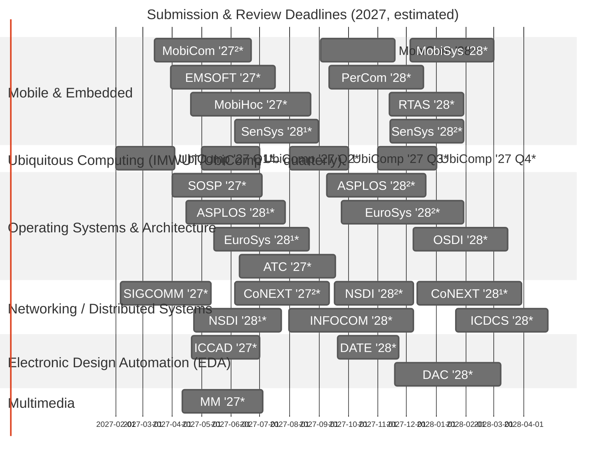

# 📱 Mobile Systems Conference Deadlines (2027)
Submission and peer-review timelines for major conferences in mobile and related systems.

> ⚠️ **All 2027-cycle dates below are estimates.** Official CFPs for this cycle are not out yet, so each date is projected from the most recent known cycle (same calendar slot, same review duration). Always confirm against the official CFP before you plan a submission.

- `*` : Estimated schedule (CFP not released yet) — applies to every entry this year
- Duration: submission → final notification
- Superscript numbers (¹ ²) denote multiple submission rounds
- Last updated: 2026-09-28

### CFP Reference Table

| Conference | Submission | Final Notification (est.) | Review Days | CFP Link |
|------------|------------|---------------------------|:-----------:|----------|
| UbiComp '27 Q1\* | 2027-02-01 | 2027-04-03 | 61 | https://www.ubicomp.org/ |
| SIGCOMM '27\* | 2027-02-06 | 2027-05-11 | 94 | https://conferences.sigcomm.org/sigcomm/2027/ |
| MobiCom '27²\* | 2027-03-13 | 2027-06-22 | 101 | https://www.sigmobile.org/mobicom/2027/ |
| EMSOFT '27\* | 2027-03-30 | 2027-07-17 | 109 | https://esweek.org/emsoft_cfp/ |
| SOSP '27\* | 2027-04-01 | 2027-07-03 | 93 | https://sigops.org/s/conferences/sosp/2027/ |
| MM '27\* | 2027-04-11 | 2027-07-04 | 84 | https://www.acmmm.org/2027/ |
| ASPLOS '28¹\* | 2027-04-15 | 2027-07-27 | 103 | https://www.asplos-conference.org/asplos2028/ |
| MobiHoc '27\* | 2027-04-20 | 2027-08-23 | 125 | https://www.sigmobile.org/mobihoc/2027/ |
| ICCAD '27\* | 2027-04-21 | 2027-07-01 | 71 | https://iccad.com/ |
| NSDI '28¹\* | 2027-04-23 | 2027-07-23 | 91 | https://www.usenix.org/conference/nsdi28/ |
| UbiComp '27 Q2\* | 2027-05-01 | 2027-07-01 | 61 | https://www.ubicomp.org/ |
| EuroSys '28¹\* | 2027-05-14 | 2027-08-21 | 99 | https://2028.eurosys.org/ |
| SenSys '28¹\* | 2027-06-05 | 2027-08-31 | 87 | https://sensys.acm.org/2028/ |
| CoNEXT '27²\* | 2027-06-05 | 2027-09-11 | 98 | https://conferences.sigcomm.org/co-next/2027/ |
| ATC '27\* | 2027-06-10 | 2027-09-18 | 100 | https://www.usenix.org/conference/atc27/ |
| INFOCOM '28\* | 2027-07-31 | 2027-12-08 | 130 | https://infocom2028.ieee-infocom.org/ |
| UbiComp '27 Q3\* | 2027-08-01 | 2027-10-01 | 61 | https://www.ubicomp.org/ |
| MobiCom '28¹\* | 2027-09-02 | 2027-11-19 | 78 | https://www.sigmobile.org/mobicom/2028/ |
| ASPLOS '28²\* | 2027-09-09 | 2027-12-21 | 103 | https://www.asplos-conference.org/asplos2028/ |
| PerCom '28\* | 2027-09-11 | 2027-12-18 | 98 | https://percom.org/call-for-papers/ |
| NSDI '28²\* | 2027-09-17 | 2027-12-08 | 82 | https://www.usenix.org/conference/nsdi28/ |
| DATE '28\* | 2027-09-20 | 2027-11-23 | 64 | https://www.date-conference.com/ |
| EuroSys '28²\* | 2027-09-24 | 2028-01-29 | 127 | https://2028.eurosys.org/ |
| UbiComp '27 Q4\* | 2027-11-01 | 2028-01-01 | 61 | https://www.ubicomp.org/ |
| RTAS '28\* | 2027-11-13 | 2028-01-29 | 77 | https://2028.rtas.org/ |
| SenSys '28²\* | 2027-11-14 | 2028-01-29 | 76 | https://sensys.acm.org/2028/ |
| DAC '28\* | 2027-11-19 | 2028-03-08 | 110 | https://www.dac.com/ |
| MobiSys '28\* | 2027-12-05 | 2028-03-01 | 87 | https://www.sigmobile.org/mobisys/2028/ |
| OSDI '28\* | 2027-12-08 | 2028-03-15 | 98 | https://www.usenix.org/conference/osdi28/ |
| CoNEXT '28¹\* | 2027-12-12 | 2028-03-30 | 109 | https://conferences.sigcomm.org/co-next/2028/ |
| ICDCS '28\* | 2028-01-21 | 2028-04-26 | 96 | https://icdcs.org/ |

### Previous Editions
* [2026 edition](README-2026.md)
* [2025 edition](README-2025.md)

### My Go-To Top CS Conference Lists
* [CSRankings](https://csrankings.org/)
* [Institutional Guidelines in South Korea (KIISE/NRF BK21+/Universities)](https://gist.github.com/Pusnow/6eb933355b5cb8d31ef1abcb3c3e1206)

---
*Inspired by [iamseonghoon/Mobile-Systems-Conference-Deadlines](https://github.com/iamseonghoon/Mobile-Systems-Conference-Deadlines).*
