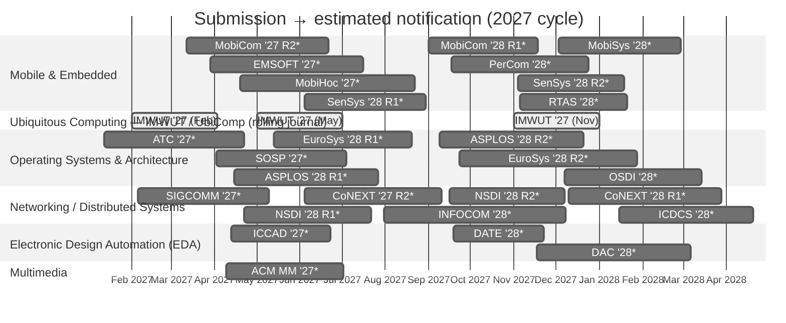

# 📱 Mobile Systems Conference Deadlines (2027)
Submission and peer-review timelines for major conferences in mobile and related systems.

> ⚠️ **Read this first.** As of the validation date below, official CFPs for the 2027 cycle are almost all unreleased. Every **🔶 Projected** date is an estimate anchored to that venue's most recent confirmed edition — treat it as a planning hint, **not** an official deadline. The **✅ Confirmed** rows are IMWUT/UbiComp's standing rolling-journal schedule, which recurs every year. **Est. Notification** is derived from each venue's typical historical review length and is an estimate in all cases. Always confirm against the official CFP before you plan a submission.

- ✅ **Confirmed** = officially announced or a standing recurring schedule
- 🔶 **Projected** = not yet announced; estimated from the most recent edition
- Review (days) = typical span from submission to final notification
- Rounds: `R1`, `R2` denote a venue's separate submission cycles
- **Validated:** 2026-09-28 · **Sources:** [ccfddl/ccf-deadlines](https://github.com/ccfddl/ccf-deadlines) + official CFP pages
- Coverage: 30 submission windows across 6 tracks (3 confirmed, 27 projected)

### 📋 CFP Reference Table

_Sorted by submission date. The same data drives the chart above._

| Conference | Submission | Est. Notification | Review (days) | Status | Source |
|------------|------------|-------------------|:-------------:|:------:|--------|
| ATC '27 [1] | 2027-01-12 | 2027-04-22 | 100 | 🔶 Projected | [link](https://sigops.org/s/conferences/atc/2026/cfp.html) |
| IMWUT '27 (Feb) [2] | 2027-02-01 | 2027-04-03 | 61 | ✅ Confirmed | [link](https://www.ubicomp.org/) |
| SIGCOMM '27 | 2027-02-05 | 2027-05-10 | 94 | 🔶 Projected | [link](https://conferences.sigcomm.org/sigcomm/2027/) |
| MobiCom '27 R2 | 2027-03-12 | 2027-06-21 | 101 | 🔶 Projected | [link](https://www.sigmobile.org/mobicom/) |
| EMSOFT '27 | 2027-03-29 | 2027-07-16 | 109 | 🔶 Projected | [link](https://esweek.org/emsoft/) |
| SOSP '27 | 2027-04-02 | 2027-07-04 | 93 | 🔶 Projected | [link](https://sigops.org/s/conferences/sosp/) |
| ACM MM '27 [3] | 2027-04-09 | 2027-07-02 | 84 | 🔶 Projected | [link](https://www.acmmm.org/) |
| ICCAD '27 | 2027-04-13 | 2027-06-23 | 71 | 🔶 Projected | [link](https://iccad.com/) |
| ASPLOS '28 R1 | 2027-04-15 | 2027-07-27 | 103 | 🔶 Projected | [link](https://www.asplos-conference.org/asplos2027/cfp/) |
| MobiHoc '27 | 2027-04-19 | 2027-08-22 | 125 | 🔶 Projected | [link](https://www.sigmobile.org/mobihoc/) |
| NSDI '28 R1 | 2027-04-22 | 2027-07-22 | 91 | 🔶 Projected | [link](https://www.usenix.org/conference/nsdi27/call-for-papers) |
| IMWUT '27 (May) | 2027-05-01 | 2027-07-01 | 61 | ✅ Confirmed | [link](https://www.ubicomp.org/) |
| EuroSys '28 R1 | 2027-05-13 | 2027-08-20 | 99 | 🔶 Projected | [link](https://2027.eurosys.org/) |
| SenSys '28 R1 | 2027-06-04 | 2027-08-30 | 87 | 🔶 Projected | [link](https://sensys.acm.org/) |
| CoNEXT '27 R2 | 2027-06-04 | 2027-09-10 | 98 | 🔶 Projected | [link](https://conferences.sigcomm.org/co-next/2026/) |
| INFOCOM '28 [4] | 2027-07-31 | 2027-12-08 | 130 | 🔶 Projected | [link](https://ccfddl.com/) |
| MobiCom '28 R1 | 2027-09-01 | 2027-11-18 | 78 | 🔶 Projected | [link](https://www.sigmobile.org/mobicom/) |
| ASPLOS '28 R2 | 2027-09-09 | 2027-12-21 | 103 | 🔶 Projected | [link](https://www.asplos-conference.org/asplos2027/cfp/) |
| NSDI '28 R2 | 2027-09-16 | 2027-12-07 | 82 | 🔶 Projected | [link](https://www.usenix.org/conference/nsdi27/call-for-papers) |
| PerCom '28 | 2027-09-17 | 2027-12-24 | 98 | 🔶 Projected | [link](https://percom.org/) |
| DATE '28 | 2027-09-19 | 2027-11-22 | 64 | 🔶 Projected | [link](https://www.date-conference.com/) |
| EuroSys '28 R2 | 2027-09-23 | 2028-01-28 | 127 | 🔶 Projected | [link](https://2027.eurosys.org/) |
| IMWUT '27 (Nov) | 2027-11-01 | 2028-01-01 | 61 | ✅ Confirmed | [link](https://www.ubicomp.org/) |
| SenSys '28 R2 | 2027-11-04 | 2028-01-19 | 76 | 🔶 Projected | [link](https://sensys.acm.org/) |
| RTAS '28 | 2027-11-05 | 2028-01-21 | 77 | 🔶 Projected | [link](https://2027.rtas.org/) |
| DAC '28 | 2027-11-17 | 2028-03-06 | 110 | 🔶 Projected | [link](https://www.dac.com/) |
| MobiSys '28 | 2027-12-03 | 2028-02-28 | 87 | 🔶 Projected | [link](https://www.sigmobile.org/mobisys/) |
| OSDI '28 | 2027-12-07 | 2028-03-14 | 98 | 🔶 Projected | [link](https://www.usenix.org/conference/osdi27/call-for-papers) |
| CoNEXT '28 R1 | 2027-12-10 | 2028-03-28 | 109 | 🔶 Projected | [link](https://conferences.sigcomm.org/co-next/2026/) |
| ICDCS '28 [5] | 2028-01-15 | 2028-04-20 | 96 | 🔶 Projected | [link](https://ccfddl.com/) |

**Notes**

1. **ATC '27** — USENIX ATC ended in 2025; now the **ACM SIGOPS Annual Technical Conference**, which resumes its historical January deadline / July conference. Low confidence — venue in transition.
2. **IMWUT '27** — IMWUT is a rolling journal: new-submission deadlines recur every year on Feb 1, May 1 and Nov 1 (Aug 1 is major-revision resubmissions only).
3. **ACM MM '27** — Higher variance — ACM MM's deadline has ranged late-March to late-April across recent editions; 2027 host not yet confirmed.
4. **INFOCOM '28** — Highest-confidence projection — INFOCOM's abstract/paper deadline has been Jul 24 / Jul 31 every year 2022–2027.
5. **ICDCS '28** — Lowest-confidence projection — ICDCS drifts between early December and late January year to year.

### How the dates were validated
Each submission date was checked on 2026-09-28 against the community-maintained
[ccfddl/ccf-deadlines](https://github.com/ccfddl/ccf-deadlines) dataset and,
where a page existed, the official conference CFP. Because the 2027-cycle CFPs
are almost all unreleased, projected dates shift the most recent confirmed
edition forward by one cycle (same calendar slot, same review length). No
official date was invented; unreleased notification dates are shown as
estimates. **Re-validate before relying on any date here.**

### Previous Editions
* [2026 edition](README-2026.md)
* [2025 edition](README-2025.md)

### Top CS Conference References
* [CSRankings](https://csrankings.org/)
* [CCF Deadlines (ccfddl)](https://ccfddl.com/)
* [Institutional Guidelines in South Korea (KIISE/NRF BK21+/Universities)](https://gist.github.com/Pusnow/6eb933355b5cb8d31ef1abcb3c3e1206)

---
*Format inspired by [iamseonghoon/Mobile-Systems-Conference-Deadlines](https://github.com/iamseonghoon/Mobile-Systems-Conference-Deadlines).*
